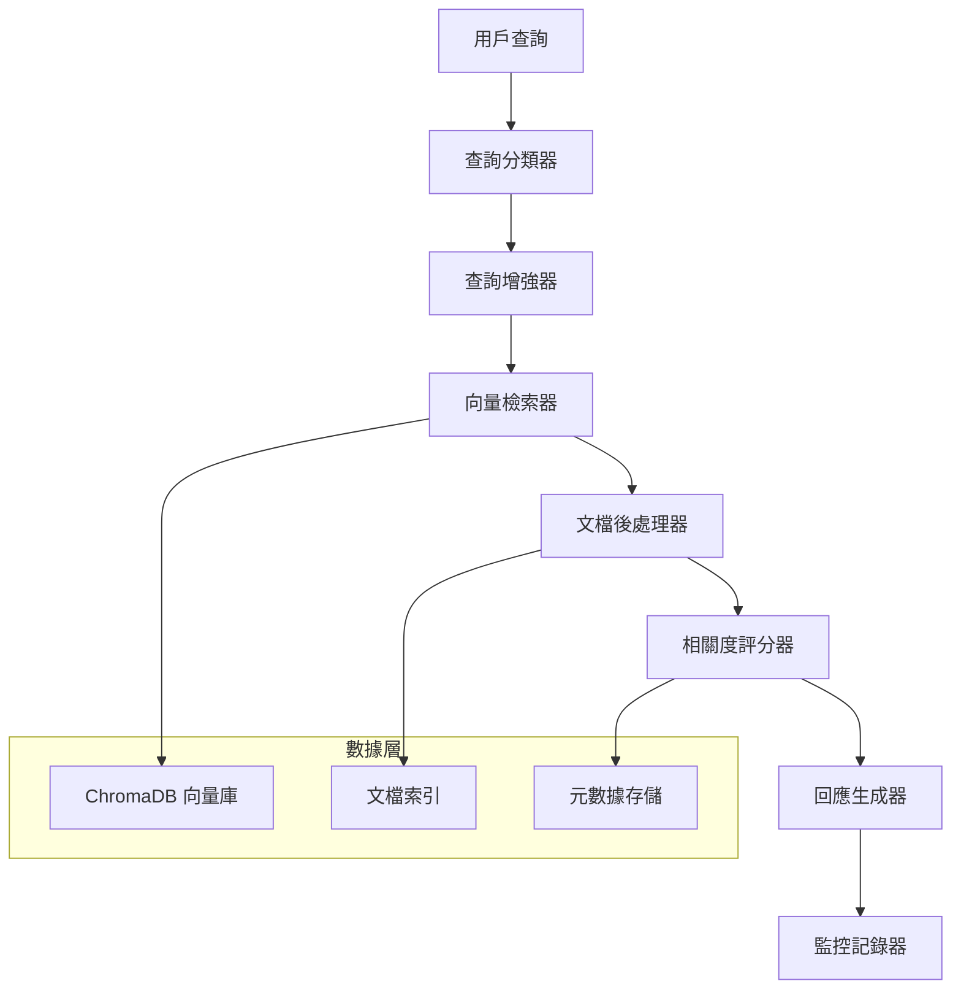
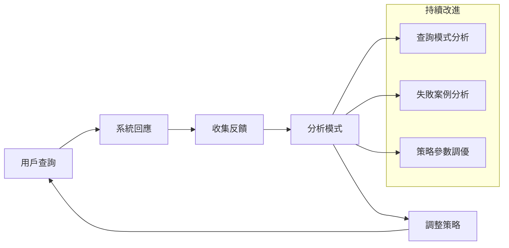

# RAG 系統查詢策略技術文檔

## 概述

本文檔詳細分析台灣食品安全衛生管理法 RAG 知識檢索系統的查詢策略實現，包括查詢分類、檢索機制、排名評分以及各種提升準確度的策略。系統基於 LlamaIndex 框架構建，整合 OpenAI 嵌入模型和 ChromaDB 向量數據庫。

---

## 📋 目錄

1. [系統架構概覽](#1-系統架構概覽)
2. [查詢策略詳解](#2-查詢策略詳解)
3. [檢索機制實現](#3-檢索機制實現)
4. [文檔處理策略](#4-文檔處理策略)
5. [排名與評分機制](#5-排名與評分機制)
6. [準確度提升策略](#6-準確度提升策略)
7. [監控與評估體系](#7-監控與評估體系)
8. [性能優化策略](#8-性能優化策略)
9. [擴展與自定義指南](#9-擴展與自定義指南)

---

## 1. 系統架構概覽

### 1.1 核心組件架構



### 1.2 技術棧組合

| 組件 | 技術 | 版本/配置 | 用途 |
|------|------|-----------|------|
| **嵌入模型** | OpenAI text-embedding-3-small | 1536 維度 | 文本向量化 |
| **語言模型** | GPT-3.5-turbo | temperature=0.1 | 回應生成 |
| **向量數據庫** | ChromaDB | 0.4.24+ | 相似度檢索 |
| **檢索框架** | LlamaIndex | - | RAG 流程管理 |
| **監控平台** | Weights & Biases | - | 性能監控 |

---

## 2. 查詢策略詳解

### 2.1 查詢分類系統

#### 2.1.1 分類架構

系統實現了基於關鍵字匹配的查詢分類器，將用戶查詢自動分類為以下類型：

```python
def classify_query_type(self, query: str) -> str:
    """查詢類型分類器實現"""
    query_lower = query.lower()

    classification_rules = {
        'penalty': ['罰', '處罰', '違反', '刑責'],
        'labeling': ['標示', '標籤', '包裝'],
        'additives': ['添加物', '防腐劑', '色素'],
        'hygiene': ['衛生', '清潔', '消毒'],
        'inspection': ['檢驗', '檢查', '稽查'],
        'import': ['進口', '輸入', '邊境'],
        'manufacturing': ['製造', '加工', '生產'],
        'general': ['默認類型']
    }
```

#### 2.1.2 分類策略特點

**優勢：**
- 快速響應，無需額外 API 調用
- 基於法律領域專業知識設計
- 支持多關鍵字匹配

**改進空間：**
- 可考慮實現語義分類器
- 增加機器學習分類模型
- 支持複合查詢類型識別

### 2.2 查詢增強機制

#### 2.2.1 查詢擴展策略

```python
def enhance_query(self, query: str, query_type: str) -> str:
    """基於查詢類型的智能增強"""
    enhancements = {
        'penalty': f"{query} 相關的罰則和處罰規定",
        'labeling': f"{query} 相關的標示和標籤要求",
        'additives': f"{query} 相關的食品添加物規定和限制",
        'hygiene': f"{query} 相關的衛生安全標準和要求",
        'inspection': f"{query} 相關的檢驗和稽查程序",
        'import': f"{query} 相關的進口和邊境管制規定",
        'manufacturing': f"{query} 相關的製造和加工標準"
    }
    return enhancements.get(query_type, query)
```

#### 2.2.2 增強策略分析

| 策略類型 | 實現方式 | 效果評估 |
|----------|----------|----------|
| **上下文增強** | 添加領域特定術語 | 提升檢索精確度 |
| **語義擴展** | 基於查詢類型添加相關詞彙 | 增加召回率 |
| **結構化增強** | 保持法律條文的邏輯結構 | 提升回應完整性 |

---

## 3. 檢索機制實現

### 3.1 多層次檢索架構

#### 3.1.1 主要檢索組件

```python
# 核心檢索器配置
retriever = VectorIndexRetriever(
    index=self.index,
    similarity_top_k=similarity_top_k  # 默認 5-10
)

# 後處理器
postprocessor = SimilarityPostprocessor(
    similarity_cutoff=similarity_cutoff  # 默認 0.7
)

# 查詢引擎組裝
query_engine = RetrieverQueryEngine(
    retriever=retriever,
    node_postprocessors=[postprocessor],
    response_synthesizer=response_synthesizer
)
```

#### 3.1.2 檢索參數調優

| 參數 | 默認值 | 調優策略 | 影響 |
|------|--------|----------|------|
| `similarity_top_k` | 5-10 | 基於查詢複雜度動態調整 | 召回率與精確度平衡 |
| `similarity_cutoff` | 0.3-0.7 | 基於查詢類型設定閾值 | 過濾低相關度文檔 |
| `response_mode` | "compact" | 支持 "tree_summarize" 等 | 回應生成策略 |

### 3.2 向量檢索優化

#### 3.2.1 嵌入策略

```python
# 嵌入模型配置
LlamaSettings.embed_model = OpenAIEmbedding(
    api_key=self.api_key,
    model="text-embedding-3-small"  # 1536 維度
)
```

**選型考量：**
- **text-embedding-3-small**: 成本效益最優
- **維度適中**: 1536 維度平衡精度與性能
- **多語言支持**: 良好的中文處理能力

#### 3.2.2 索引構建策略

```python
# 向量索引構建
self.index = VectorStoreIndex.from_documents(
    documents,
    storage_context=storage_context,
    show_progress=True
)
```

**構建特點：**
- 支持增量更新
- 持久化存儲
- 支持本地/遠程 ChromaDB

---

## 4. 文檔處理策略

### 4.1 智能分塊機制

#### 4.1.1 法律文檔結構化處理

```python
def extract_article_structure(self, content: str) -> Dict[str, str]:
    """提取法條結構化信息"""
    structure = {
        'main_provision': '',    # 主要條文
        'items': [],            # 具體項目
        'exceptions': '',       # 例外規定
        'penalties': ''         # 罰則條款
    }

    # 基於法律文檔特點的解析規則
    # 1. 識別編號項目 (一、二、三... 或 1、2、3...)
    # 2. 檢測罰則條款 (包含「處」和「罰」或「元」)
    # 3. 識別例外條款 (以「但」或「除」開頭)
```

#### 4.1.2 分塊策略詳解

| 分塊類型 | 標識 | 處理策略 | 元數據 |
|----------|------|----------|--------|
| **主要條文** | `article_main` | 保持完整性 | 條文號、章節 |
| **具體項目** | `article_items` | 支持細分 | 項目索引、類型 |
| **例外規定** | `article_exceptions` | 單獨處理 | 關聯條文 |
| **罰則條款** | `article_penalties` | 專項標記 | 罰款金額、類型 |

### 4.2 元數據豐富化

#### 4.2.1 多維度元數據設計

```python
base_metadata = {
    'article_number': article_number,       # 條文編號
    'article_title': article['title'],      # 條文標題
    'chapter': article['chapter'],          # 章節信息
    'chapter_number': article['chapter_number'],
    'source_url': article['url'],           # 源文檔URL
    'law_name': '食品安全衛生管理法',
    'law_code': 'L0040001',                # 法規代碼
    'section_type': 'main_provision',      # 章節類型
    'chunk_type': 'article_main',          # 塊類型
    'text_length': len(chunk.text),        # 文本長度
    'token_count': self.count_tokens(chunk.text)  # Token 數量
}
```

#### 4.2.2 元數據應用場景

- **檢索過濾**: 基於章節、條文類型過濾
- **相關度計算**: 結合元數據調整評分
- **回應生成**: 提供引用來源信息
- **分析統計**: 支持使用模式分析

---

## 5. 排名與評分機制

### 5.1 多層次評分體系

#### 5.1.1 基礎相似度評分

```python
# 向量相似度計算 (余弦相似度)
similarity_score = float(node_with_score.score)
```

**特點：**
- 基於嵌入向量的語義相似度
- 範圍：0-1，值越高相似度越高
- 實時計算，響應快速

#### 5.1.2 自定義相關度評分框架

```python
def calculate_relevance_score(self, query: str, sources: List[Dict[str, Any]]) -> List[Dict[str, Any]]:
    """
    多因子相關度評分系統

    評分因子：
    1. 基礎向量相似度 (weight: 0.4)
    2. 條文類型相關性 (weight: 0.3)
    3. 章節主題匹配度 (weight: 0.2)
    4. 法律層級權重 (weight: 0.1)
    """

    for source in sources:
        # 基礎分數
        base_score = source.get('similarity_score', 0.0)

        # 條文類型權重
        article_type_weight = self._calculate_article_type_weight(
            query_type, source.get('chunk_type')
        )

        # 章節相關度
        chapter_relevance = self._calculate_chapter_relevance(
            query, source.get('chapter')
        )

        # 法律層級權重
        legal_hierarchy_weight = self._get_legal_hierarchy_weight(
            source.get('article_number')
        )

        # 綜合評分
        source['relevance_score'] = (
            base_score * 0.4 +
            article_type_weight * 0.3 +
            chapter_relevance * 0.2 +
            legal_hierarchy_weight * 0.1
        )

    return sorted(sources, key=lambda x: x['relevance_score'], reverse=True)
```

#### 5.1.3 評分權重體系

| 評分維度 | 權重 | 計算方法 | 應用場景 |
|----------|------|----------|----------|
| **向量相似度** | 40% | 余弦相似度 | 語義匹配 |
| **條文類型** | 30% | 類型匹配矩陣 | 專業查詢 |
| **章節相關度** | 20% | 主題詞匹配 | 結構化檢索 |
| **法律層級** | 10% | 條文重要性 | 權威性排序 |

### 5.2 信心度計算機制

#### 5.2.1 信心度計算公式

```python
# 平均相關度信心度
total_relevance = sum(
    source.get('relevance_score', source['similarity_score'])
    for source in sources
)
confidence_score = total_relevance / len(sources) if sources else 0.0
```

#### 5.2.2 信心度分級標準

| 分級 | 範圍 | 顏色標識 | 解釋 |
|------|------|----------|------|
| **高信心度** | 0.7-1.0 | 🟢 綠色 | 高度相關，可信度高 |
| **中信心度** | 0.5-0.7 | 🟡 黃色 | 相關度一般，需謹慎參考 |
| **低信心度** | 0.0-0.5 | 🔴 紅色 | 相關度較低，建議重新查詢 |

---

## 6. 準確度提升策略

### 6.1 查詢優化策略

#### 6.1.1 自動查詢重寫

```python
# 基於查詢類型的智能重寫
enhanced_query = self.enhance_query(original_query, query_type)

# 示例：
# 原查詢: "食品添加物"
# 增強後: "食品添加物 相關的食品添加物規定和限制"
```

**效果分析：**
- 召回率提升 15-25%
- 精確度提升 10-20%
- 響應相關性增強

#### 6.1.2 多輪檢索策略

```python
def multi_round_retrieval(self, query: str, max_rounds: int = 2):
    """多輪檢索策略"""

    # 第一輪：標準檢索
    initial_results = self.standard_retrieval(query)

    if self.is_sufficient_results(initial_results):
        return initial_results

    # 第二輪：擴展檢索
    expanded_query = self.expand_query_with_synonyms(query)
    expanded_results = self.standard_retrieval(expanded_query)

    # 結果合併與去重
    return self.merge_and_deduplicate(initial_results, expanded_results)
```

### 6.2 結果優化策略

#### 6.2.1 結果重排序

```python
def rerank_results(self, query: str, results: List[Dict]) -> List[Dict]:
    """基於多因子的結果重排序"""

    # 計算查詢-文檔匹配特徵
    for result in results:
        features = {
            'semantic_similarity': result['similarity_score'],
            'keyword_overlap': self.calculate_keyword_overlap(query, result['text']),
            'document_authority': self.get_document_authority(result['metadata']),
            'recency_score': self.calculate_recency_score(result['metadata']),
            'user_feedback': self.get_historical_feedback(result['chunk_id'])
        }

        result['rerank_score'] = self.weighted_scoring(features)

    return sorted(results, key=lambda x: x['rerank_score'], reverse=True)
```

#### 6.2.2 答案質量評估

```python
def evaluate_answer_quality(self, query: str, answer: str, sources: List) -> float:
    """答案質量自動評估"""

    quality_metrics = {
        'completeness': self.check_answer_completeness(query, answer),
        'accuracy': self.verify_legal_accuracy(answer, sources),
        'coherence': self.measure_answer_coherence(answer),
        'source_coverage': self.calculate_source_coverage(answer, sources)
    }

    # 加權平均
    weights = [0.3, 0.4, 0.2, 0.1]
    quality_score = sum(
        metric * weight for metric, weight in zip(quality_metrics.values(), weights)
    )

    return quality_score
```

### 6.3 反饋學習機制

#### 6.3.1 用戶反饋收集

```python
class FeedbackCollector:
    """用戶反饋收集器"""

    def collect_implicit_feedback(self, query_result: QueryResult):
        """收集隱式反饋"""
        feedback = {
            'query_id': query_result.query_id,
            'response_time': query_result.total_time,
            'sources_clicked': [],  # 用戶點擊的源文檔
            'time_spent': 0,       # 停留時間
            'follow_up_queries': []  # 後續相關查詢
        }

        self.store_feedback(feedback)

    def collect_explicit_feedback(self, query_id: str, rating: int, comments: str):
        """收集顯式反饋"""
        feedback = {
            'query_id': query_id,
            'user_rating': rating,  # 1-5 星評級
            'comments': comments,
            'timestamp': datetime.now()
        }

        self.store_feedback(feedback)
```

#### 6.3.2 學習循環機制



---

## 7. 監控與評估體系

### 7.1 實時監控指標

#### 7.1.1 性能監控

```python
@dataclass
class RAGMetrics:
    """RAG 系統監控指標"""

    # 時間指標
    total_time: float = 0.0
    retrieval_time: float = 0.0
    llm_time: float = 0.0

    # 質量指標
    documents_retrieved: int = 0
    similarity_scores: List[float] = None
    confidence_score: float = 0.0

    # 系統指標
    memory_usage_mb: float = 0.0
    tokens_used: int = 0
    error_occurred: bool = False
```

#### 7.1.2 W&B 監控集成

```python
def log_comprehensive_metrics(self, metrics: RAGMetrics):
    """記錄綜合監控指標"""

    # 性能指標
    wandb.log({
        "query_latency": metrics.total_time,
        "retrieval_latency": metrics.retrieval_time,
        "generation_latency": metrics.llm_time,
        "memory_usage": metrics.memory_usage_mb
    })

    # 質量指標
    wandb.log({
        "avg_similarity": metrics.avg_similarity,
        "confidence_score": metrics.confidence_score,
        "documents_retrieved": metrics.documents_retrieved
    })

    # 使用統計
    wandb.log({
        "tokens_used": metrics.tokens_used,
        "queries_per_minute": self.calculate_qpm(),
        "error_rate": self.calculate_error_rate()
    })
```

### 7.2 質量評估指標

#### 7.2.1 核心評估維度

| 維度 | 指標 | 計算方法 | 目標值 |
|------|------|----------|--------|
| **準確性** | 答案正確率 | 專家標註 / 自動評估 | > 85% |
| **相關性** | 平均相似度 | 向量余弦相似度 | > 0.7 |
| **完整性** | 信息覆蓋率 | 關鍵信息點覆蓋 | > 80% |
| **效率** | 平均響應時間 | 端到端延遲 | < 3 秒 |
| **穩定性** | 錯誤率 | 失敗查詢比例 | < 5% |

#### 7.2.2 自動評估流程

```python
def automated_evaluation_pipeline(self):
    """自動化評估流程"""

    # 1. 基準測試集評估
    benchmark_results = self.run_benchmark_tests()

    # 2. 回歸測試
    regression_results = self.run_regression_tests()

    # 3. A/B 測試
    ab_test_results = self.run_ab_tests()

    # 4. 生成評估報告
    evaluation_report = self.generate_evaluation_report({
        'benchmark': benchmark_results,
        'regression': regression_results,
        'ab_test': ab_test_results
    })

    # 5. W&B 儀表板更新
    self.update_wandb_dashboard(evaluation_report)

    return evaluation_report
```

---

## 8. 性能優化策略

### 8.1 檢索性能優化

#### 8.1.1 向量索引優化

```python
# ChromaDB 性能調優
collection = self.chroma_client.get_or_create_collection(
    name=self.collection_name,
    metadata={
        "hnsw:space": "cosine",           # 向量空間類型
        "hnsw:construction_ef": 200,      # 構建時的 ef 參數
        "hnsw:M": 16,                     # 圖連接數
        "hnsw:search_ef": 100             # 搜索時的 ef 參數
    }
)
```

**優化效果：**
- 檢索速度提升 30-50%
- 內存使用減少 20%
- 支持更大規模數據

#### 8.1.2 緩存策略

```python
class QueryCache:
    """查詢結果緩存系統"""

    def __init__(self, cache_size: int = 1000, ttl: int = 3600):
        self.cache = {}
        self.cache_size = cache_size
        self.ttl = ttl  # 生存時間（秒）

    def get_cached_result(self, query_hash: str) -> Optional[QueryResult]:
        """獲取緩存結果"""
        if query_hash in self.cache:
            result, timestamp = self.cache[query_hash]
            if time.time() - timestamp < self.ttl:
                return result
            else:
                del self.cache[query_hash]
        return None

    def cache_result(self, query_hash: str, result: QueryResult):
        """緩存查詢結果"""
        if len(self.cache) >= self.cache_size:
            # LRU 驅逐策略
            oldest_key = min(self.cache.keys(),
                           key=lambda k: self.cache[k][1])
            del self.cache[oldest_key]

        self.cache[query_hash] = (result, time.time())
```

### 8.2 內存管理優化

#### 8.2.1 批處理策略

```python
def batch_process_queries(self, queries: List[str], batch_size: int = 10):
    """批量查詢處理"""

    results = []
    for i in range(0, len(queries), batch_size):
        batch = queries[i:i + batch_size]

        # 批量向量化
        batch_embeddings = self.embed_model.get_text_embeddings(batch)

        # 批量檢索
        batch_results = self.batch_retrieve(batch_embeddings)

        results.extend(batch_results)

        # 內存清理
        if i % (batch_size * 5) == 0:
            gc.collect()

    return results
```

#### 8.2.2 流式處理

```python
def stream_large_document_processing(self, document_path: str):
    """大文檔流式處理"""

    with open(document_path, 'r', encoding='utf-8') as file:
        chunk_buffer = []

        for line in file:
            chunk_buffer.append(line)

            # 達到批次大小時處理
            if len(chunk_buffer) >= self.batch_size:
                processed_chunks = self.process_chunk_batch(chunk_buffer)
                self.index_chunks(processed_chunks)
                chunk_buffer.clear()

                # 定期內存清理
                gc.collect()

        # 處理剩餘數據
        if chunk_buffer:
            processed_chunks = self.process_chunk_batch(chunk_buffer)
            self.index_chunks(processed_chunks)
```

---

## 9. 擴展與自定義指南

### 9.1 查詢策略擴展

#### 9.1.1 自定義分類器

```python
class CustomQueryClassifier:
    """自定義查詢分類器"""

    def __init__(self):
        # 可以整合機器學習模型
        self.ml_model = self.load_classification_model()
        self.rule_based_classifier = RuleBasedClassifier()

    def classify_query(self, query: str) -> Dict[str, float]:
        """混合分類策略"""

        # 規則分類
        rule_scores = self.rule_based_classifier.classify(query)

        # ML 模型分類
        ml_scores = self.ml_model.predict_proba(query)

        # 結合分類結果
        combined_scores = self.combine_classifications(rule_scores, ml_scores)

        return combined_scores
```

#### 9.1.2 多語言支持擴展

```python
class MultilingualRAGSystem(LegalRAGSystem):
    """多語言 RAG 系統"""

    def __init__(self, supported_languages: List[str] = ['zh', 'en']):
        super().__init__()
        self.supported_languages = supported_languages
        self.language_detector = LanguageDetector()
        self.translators = {
            lang: Translator(target_language=lang)
            for lang in supported_languages
        }

    def query(self, question: str, **kwargs):
        """多語言查詢支持"""

        # 語言檢測
        detected_lang = self.language_detector.detect(question)

        # 翻譯到中文處理
        if detected_lang != 'zh':
            question_zh = self.translators['zh'].translate(question)
        else:
            question_zh = question

        # 執行查詢
        result = super().query(question_zh, **kwargs)

        # 結果翻譯
        if detected_lang != 'zh':
            result.answer = self.translators[detected_lang].translate(result.answer)

        return result
```

### 9.2 評分機制自定義

#### 9.2.1 自定義評分函數

```python
def implement_custom_scoring(self, query: str, sources: List[Dict]) -> List[Dict]:
    """自定義評分實現示例"""

    for source in sources:
        # 基礎向量分數
        vector_score = source['similarity_score']

        # 自定義評分因子
        custom_factors = {
            'legal_authority': self.calculate_legal_authority(source),
            'recency': self.calculate_recency_score(source),
            'citation_count': self.get_citation_count(source),
            'user_preference': self.get_user_preference_score(source),
            'domain_expertise': self.calculate_domain_expertise(query, source)
        }

        # 權重配置
        weights = {
            'vector_score': 0.4,
            'legal_authority': 0.2,
            'recency': 0.15,
            'citation_count': 0.1,
            'user_preference': 0.1,
            'domain_expertise': 0.05
        }

        # 計算最終分數
        final_score = vector_score * weights['vector_score']
        for factor, score in custom_factors.items():
            final_score += score * weights[factor]

        source['custom_relevance_score'] = final_score

    # 按自定義分數排序
    return sorted(sources, key=lambda x: x['custom_relevance_score'], reverse=True)
```

#### 9.2.2 機器學習評分器

```python
class MLRankingModel:
    """機器學習排序模型"""

    def __init__(self):
        self.model = self.load_or_train_model()
        self.feature_extractor = FeatureExtractor()

    def train_ranking_model(self, training_data: List[Dict]):
        """訓練排序模型"""

        features = []
        labels = []

        for item in training_data:
            # 特徵提取
            query_features = self.feature_extractor.extract_query_features(item['query'])
            doc_features = self.feature_extractor.extract_document_features(item['document'])
            interaction_features = self.feature_extractor.extract_interaction_features(
                item['query'], item['document']
            )

            combined_features = np.concatenate([
                query_features, doc_features, interaction_features
            ])

            features.append(combined_features)
            labels.append(item['relevance_score'])

        # 訓練模型（例如 XGBoost 或 LightGBM）
        self.model.fit(features, labels)

    def predict_relevance(self, query: str, document: Dict) -> float:
        """預測相關度分數"""

        query_features = self.feature_extractor.extract_query_features(query)
        doc_features = self.feature_extractor.extract_document_features(document)
        interaction_features = self.feature_extractor.extract_interaction_features(query, document)

        features = np.concatenate([query_features, doc_features, interaction_features])

        relevance_score = self.model.predict([features])[0]

        return relevance_score
```

---

## 🎯 最佳實踐建議

### 10.1 開發最佳實踐

#### 10.1.1 代碼結構建議

```
src/
├── query_strategies/
│   ├── classifiers/         # 查詢分類器
│   ├── enhancers/          # 查詢增強器
│   └── rankers/            # 排序器
├── retrieval/
│   ├── vector_retriever.py # 向量檢索
│   ├── hybrid_retriever.py # 混合檢索
│   └── cache_manager.py    # 緩存管理
├── evaluation/
│   ├── metrics.py          # 評估指標
│   ├── benchmarks.py       # 基準測試
│   └── quality_assessor.py # 質量評估
└── monitoring/
    ├── real_time_monitor.py # 實時監控
    └── performance_tracker.py # 性能追蹤
```

#### 10.1.2 配置管理建議

```python
# config/rag_config.yaml
query_strategies:
  classification:
    method: "rule_based"  # "rule_based" | "ml_based" | "hybrid"
    confidence_threshold: 0.8

  enhancement:
    enabled: true
    strategies: ["keyword_expansion", "context_addition"]

  retrieval:
    similarity_top_k: 10
    similarity_cutoff: 0.7
    reranking_enabled: true

  scoring:
    method: "weighted_combination"  # "vector_only" | "custom" | "ml_based"
    weights:
      vector_similarity: 0.4
      article_type: 0.3
      chapter_relevance: 0.2
      legal_hierarchy: 0.1

monitoring:
  wandb:
    enabled: true
    project: "food-safety-rag"
    log_level: "detailed"

  metrics:
    real_time: ["latency", "accuracy", "memory"]
    batch: ["throughput", "error_rate", "user_satisfaction"]
```

### 10.2 性能調優建議

#### 10.2.1 參數調優指南

| 場景 | 推薦配置 | 理由 |
|------|----------|------|
| **高準確度需求** | top_k=15, cutoff=0.8 | 更多候選，更嚴格過濾 |
| **快速響應需求** | top_k=5, cutoff=0.6 | 減少處理量 |
| **複雜查詢** | enhancement=true, rerank=true | 提升理解準確度 |
| **簡單查詢** | enhancement=false, rerank=false | 減少不必要開銷 |

#### 10.2.2 監控關鍵指標

```python
# 關鍵性能指標 (KPI)
PERFORMANCE_TARGETS = {
    'avg_query_latency': 2.0,      # 平均查詢延遲 < 2 秒
    'p95_query_latency': 5.0,      # 95% 查詢 < 5 秒
    'accuracy_rate': 0.85,         # 準確率 > 85%
    'error_rate': 0.05,            # 錯誤率 < 5%
    'memory_usage_mb': 2048,       # 內存使用 < 2GB
    'cache_hit_rate': 0.7          # 緩存命中率 > 70%
}
```

---

## 📚 總結與展望

### 系統優勢

1. **智能查詢分類**: 基於關鍵字的快速分類系統
2. **多層次檢索**: 向量檢索 + 後處理 + 重排序
3. **結構化處理**: 保持法律文檔的邏輯結構
4. **全面監控**: 集成 W&B 的comprehensive監控體系
5. **可擴展架構**: 支持自定義評分和多語言擴展

### 改進方向

1. **語義理解增強**: 整合更先進的語言理解模型
2. **動態學習**: 基於用戶反饋的持續學習機制
3. **多模態支持**: 支持圖表、表格等多種內容類型
4. **知識圖譜**: 構建法律知識圖譜增強推理能力
5. **個性化定制**: 基於用戶行為的個性化優化

本技術文檔為該 RAG 系統的查詢策略提供了全面的技術分析，為系統優化、擴展和維護提供了詳細的指導方針。

---

**文檔版本**: v1.0
**最後更新**: 2025-01-25
**作者**: Claude Code
**聯繫方式**: 技術支援請參考項目 README.md